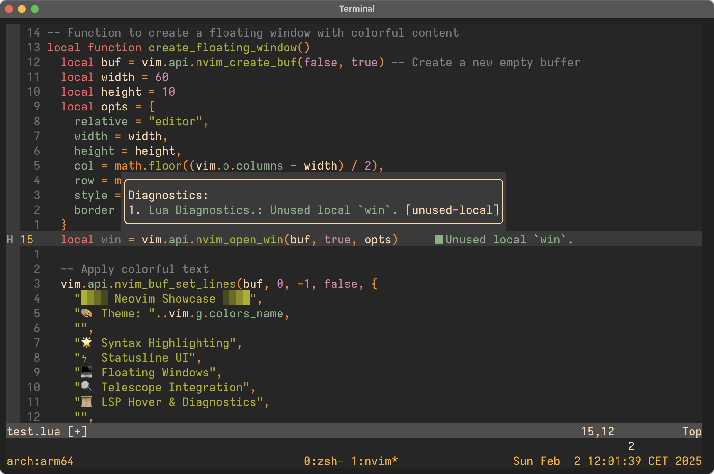

My dotfiles with a stow-like script.

    $ ./deploy/deploy.sh

Install [bear](https://github.com/rizsotto/Bear), an awesome project to generate compile commands.
Cross-platform OpenGL terminal emulator: [Alacritty](https://alacritty.org/)
Nerd fonts: [Iosevka Nerd Font](https://github.com/ryanoasis/nerd-fonts/releases/download/v3.2.1/Iosevka.zip)
Minimal zsh: [github.com](https://github.com/subnixr/minimal)
Helix: [Helix editor](https://helix-editor.com/)
Neovim: [neovim.io](https://neovim.io/)
Emacs: [gnu.org](https://www.gnu.org/software/emacs/)

All other plugins are referneced in the configurarion files.
